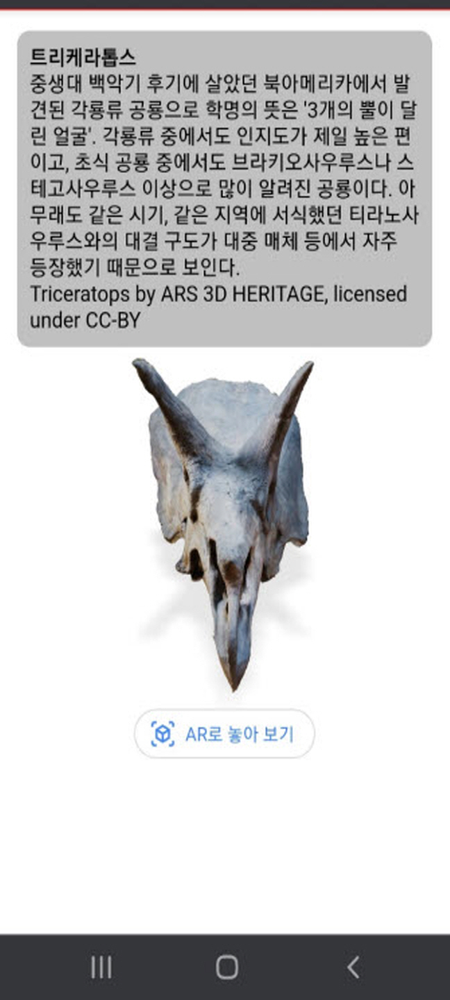
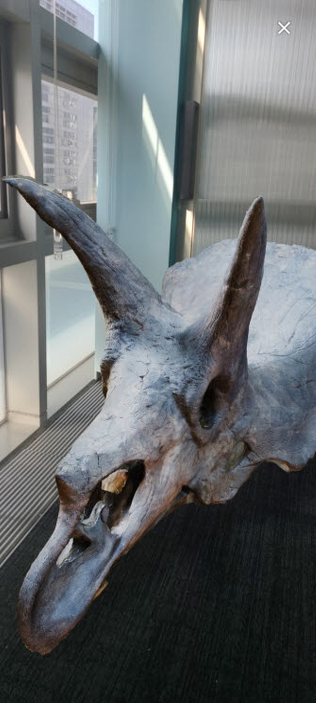
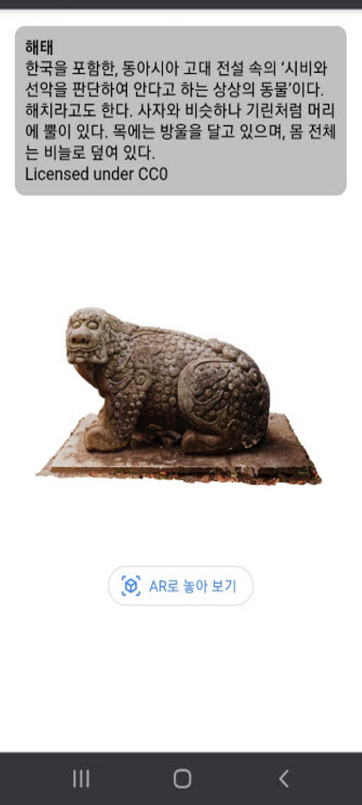
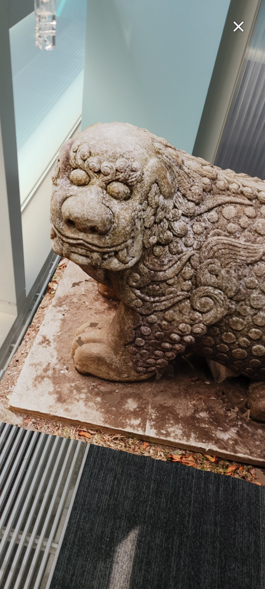

# 내 손안의 실감 라이브러리 (미리보기)

## 개발 의도
자연사와 문화사에 대한 3D 공공 데이터를 수집 및 재구성하여 어디에서나 쉽게 이용 가능한 AR 체험 웹 서비스인 `<내 손안의 실감 라이브러리>` 를 개발하고자 합니다.
  

## 서비스 장점
- 팬데믹으로 인해 관광, 교육 등에서 어려움이 있을 때 이를 보완할 수 있습니다.
- 먼 지역, 먼 나라의 박물관을 방문하지 않아도 우리 집과 학교 운동장 등에서 체험 가능합니다.
- 앱을 설치하거나 업데이트 하지 않아도, 모바일 웹으로 3D와 AR을 이용할 수 있습니다.
- 앞으로 다국어화를 추가해 통해 우리의 문화재를 영미권 등 해외에도 보여주고 싶습니다.
  

## 앱 콘텐츠 구성
1. 세 가지 메인 메뉴로 `자연사, 우리나라 문화재, 해외 문화재`를 구성하려 합니다.
2. 메뉴를 선택해 들어가면 해당 분야의 3D 콘텐츠들과 그에 대한 설명을 볼 수 있습니다.
3. 또한 AR로 보기 기능으로 실감나게 체험하듯이 볼 수 있습니다.

  

## 시범 콘텐츠 웹페이지
- 자연사 유산  

 
- 역사 유산  

 
 